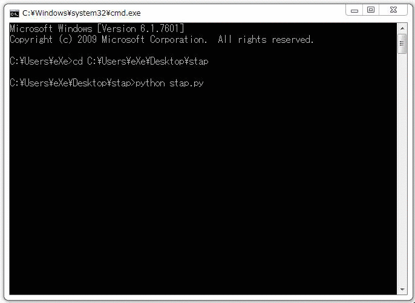

# STAP

python 2.x

Caesar暗号を生成/解読するスクリプト

#Details

alphabet.py - Caesar暗号を生成/解読するスクリプトをアルファベットリストに変更(高速化)

stap.py - STAPという文字列を高速に探索するスクリプト(悪用厳禁)

#Author
Fumihiko Akagi

#Copyright
###!!使用する際はライセンスを読んで使用してください!!
    本プログラムを使用したことによって起きた問題などに関しては
    製作者は責任を持たず、使用者の自己責任とさせていただきます。
    Password CrackやDoS攻撃に応用するなどの悪用を固く禁じます。
* * *
    The MIT License

    Copyright (c) 2013 Fumihiko Akagi

    Permission is hereby granted, free of charge, to any person obtaining a copy of this
    software and associateddocumentation files (the "Software"), to deal in the Software
    without restriction, including without limitationthe rights to use, copy, modify, merge,
    publish, distribute,sublicense, and/or sell copies of the Software,and to permit persons
    to whom the Software is furnished to do so, subject to the following conditions:

    The above copyright notice and this permission notice shall be included in all copies or 
    substantial portions of the Software.

    THE SOFTWARE IS PROVIDED "AS IS", WITHOUT WARRANTY OF ANY KIND, EXPRESS OR IMPLIED, 
    INCLUDING BUT NOT LIMITED TO THE   WARRANTIES OF MERCHANTABILITY, FITNESS FOR A
    PARTICULAR PURPOSE AND NONINFRINGEMENT. IN NO EVENT SHALL THE A UTHORS OR COPYRIGHT
    HOLDERS BE LIABLE FOR ANY CLAIM, DAMAGES OR OTHER LIABILITY, WHETHER IN AN ACTION OF
    CONTRACT, TORT OR OTHERWISE, ARISING FROM, OUT OF OR IN CONNECTION WITH THE SOFTWARE
    OR THE USE OR OTHER DEALINGS IN THE SOFTWARE.

